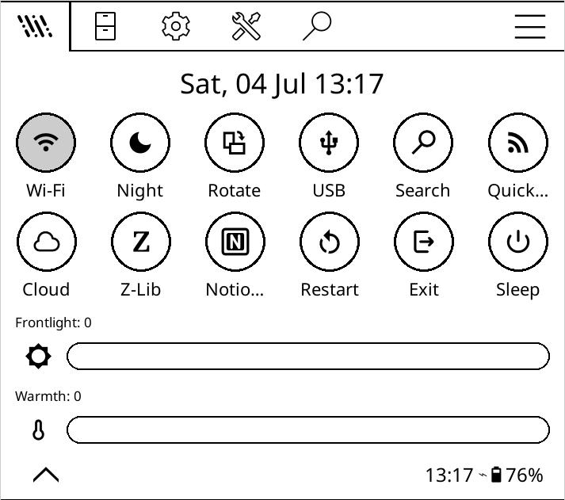
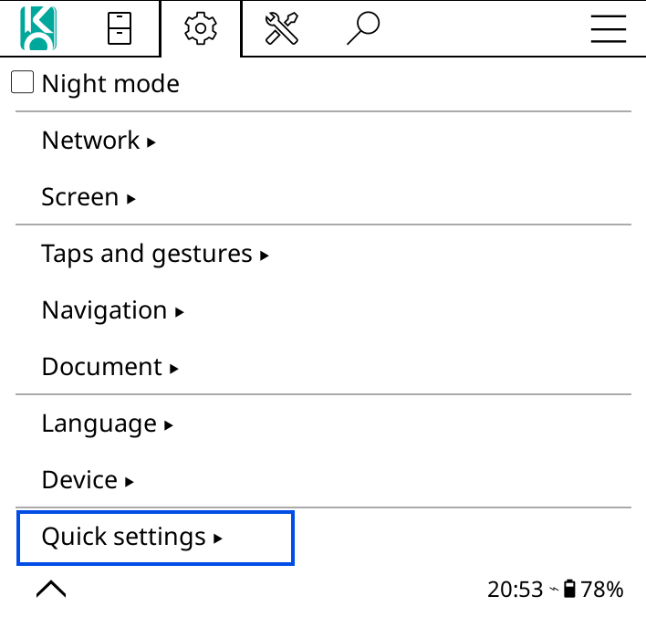
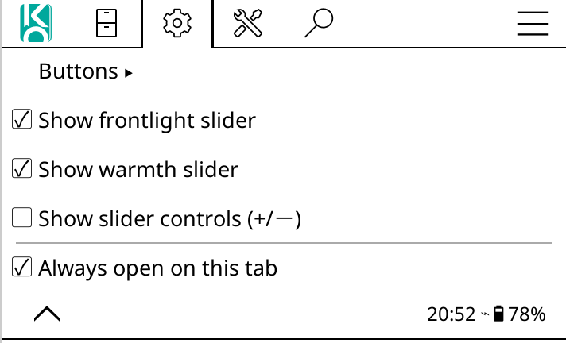

# koreader-quicksettings

Custom Quick Settings patch for KOReader.

## Complete feature set

This patch adds a dedicated Quick Settings tab at the far left of KOReader's top menu (File Manager + Reader), and provides extensive customization for buttons, info bar, and icon packs.

### Quick Settings tab

- Injects a custom Quick Settings tab in both File Manager and Reader menus.
- Optional `Always open on this tab` behavior.
- Customizable tab icon (default icon, other-repo icon, and additional custom icons).
- Works with KOReader icon lookup in user `icons/` directory.

### Quick action buttons

- Reorder buttons (`Arrange buttons`).
- Enable/disable each button from settings.
- Grid layout controls:
  - Rows: `1-3`
  - Items per row: `1-10`
- Show/hide text labels under button icons.
- Button shape modes:
  - `No shape`
  - `Circle`
  - `Square`
  - `Squircle`
  - `Pebble` (custom drawn)
  - `Hexagon` (custom drawn)
  - `Pentagon` (custom drawn)
  - `Teardrop` (custom drawn)
  - `Flower` (custom drawn)
- `Reset button defaults` entry to restore button-related settings.

### Supported quick actions

Core actions:

- Wi-Fi toggle (active state + SSID label where available)
- Night mode
- Rotate
- USB mass storage request
- Restart (with confirm)
- Exit (with confirm)
- Sleep / suspend / power-off
- File search
- Cloud storage
- Z-Library
- Calibre wireless
- OPDS catalog
- NotionSync
- Reading Streak
- Frontlight toggle

Additional icon-backed actions (plugin dependent):

- Reading progress (`stats_progress`)
- Reading calendar (`stats_calendar`)
- Battery stats (`battery_stats`)
- LocalSend
- Connections
- Puzzle
- Crossword
- Casual Chess
- Chess
- KOSync
- FileBrowser+
- BookFusion
- Focus

If a plugin/capability is not available, related buttons are hidden (or show an info message when applicable).

### Frontlight and warmth controls

- Rounded slider rendering.
- Tap + swipe/pan interaction.
- Tri-state icon controls for both brightness and warmth (`off`, `mid`, `max`).
- Optional show/hide for slider `+/-` controls.
- Warmth section shown only on devices with natural-light support.

### Info bar (clock) settings

Clock defaults on fresh install:

- Format: `Weekday, DD Mon hh:MM` (`%a, %d %b %H:%M`)
- Center aligned
- Non-segmented stacked layout

Clock controls include:

- Show/hide clock.
- Primary and secondary custom format strings (`os.date` style).
- Alignment (`left`, `center`, `right`).
- Text layout (`small`, `big`, `big + small`).
- Font family selection (presets + custom font name).
- Font style (`regular`, `bold`, `italic`, `bold italic`) with fallback handling.
- Big/small font size controls.
- Header layouts:
  - `stacked`
  - `two columns`
  - `three columns`
- Segment content mapping (clock block / primary / secondary / info / empty).
- Two-column split ratio presets + custom input.
- Optional info line with selectable data items.
- `Reset clock defaults` entry.

### Clock info line data (selectable)

- Reading progress
- Page position
- Book title
- Time left
- Battery
- Wi-Fi
- Frontlight
- Warmth
- Night mode
- Rotation

Clock refresh behavior adapts to format:

- Per-second updates when `%S` is present
- Otherwise minute-aligned updates

## Icons and assets

This repo includes a mixed icon pack (`.svg` and `.png`) in `icons/`, including:

- Existing quick icons (`quick_*`)
- Brightness and warmth tri-state icons
- Additional icons from `renandeivison/quicksettings`
- Extra custom icons for tab/icon experiments (e.g. `menu.svg`, `network_intelligence.svg`, etc.)

## References

- Original patch inspiration: [qewer33/koreader-patches](https://github.com/qewer33/koreader-patches)
- Additional icon source: [renandeivison/quicksettings](https://github.com/renandeivison/quicksettings)

## Installation

1. Find your KOReader user directory.
2. Copy `2-quick-settings.lua` into `patches/`.
3. Copy all files from this repo's `icons/` folder into KOReader's `icons/`.
4. Fully restart KOReader.

## KOReader folder locations (common)

- Kindle: `/mnt/us/koreader/`
- Kobo: `.adds/koreader/`
- Android: `/storage/emulated/0/koreader/` or `/sdcard/koreader/`
- Linux desktop: `~/.config/koreader/`

Inside KOReader user directory:

- `patches/2-quick-settings.lua`
- `icons/*` (both `.svg` and `.png`)

## Verify

After restart:

- Quick Settings tab appears and opens.
- Selected tab icon is visible.
- Button grid/shape/label settings apply.
- New icons render for enabled actions.
- Frontlight/warmth sliders react to touch.
- Clock/info bar settings apply (format, layout, fonts, info items).

## Uninstall

Remove:

- `patches/2-quick-settings.lua`
- Copied icons from `icons/` (both `.svg` and `.png`)

Then restart KOReader.

## Screenshots

